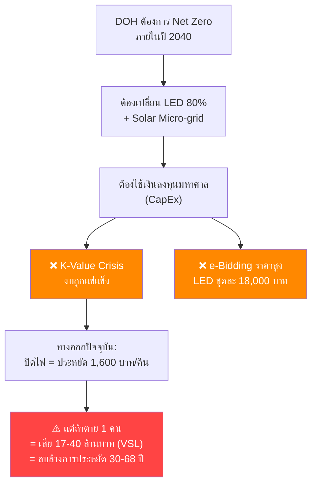
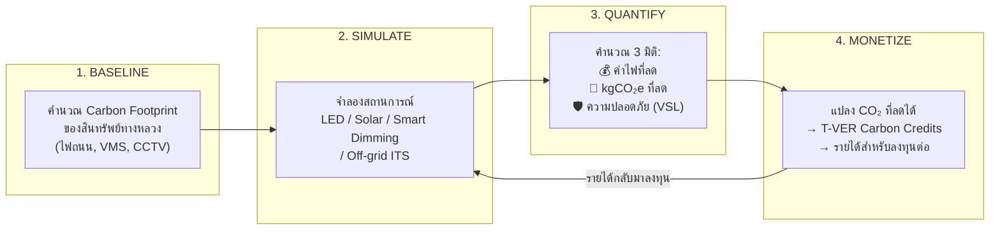

# DOH Hackathon 2026 — Solution Concepts

> **⏰ Deadline: May 15, 2026 (7 days) — First round: PDF ≤10 slides + optional 5-min video**

---

## 🏆 Recommended Solution: "CarbonWay" (คาร์บอนเวย์)

### One-liner

> **"ระบบจำลองเส้นทางสู่ทางหลวงไร้คาร์บอน ที่เปลี่ยนค่าไฟ 1.7 พันล้านบาท/ปี ให้กลายเป็นแหล่งทุนพลังงานสะอาดด้วยกลไกคาร์บอนเครดิต"**
>
> A system that transforms DOH's 1.7 billion THB/year electricity bill into a self-funding clean energy transition through carbon credit mechanisms.

### Why This Wins

| Judging Criteria | How CarbonWay Scores |
|---|---|
| **Innovation & Creativity** | Nobody in Thailand applies carbon credit finance to government highway infrastructure — this is a first |
| **Feasibility & Practicality** | Built on Thailand's existing T-VER program (TGO), uses only open data, no hardware |
| **Impact & Value** | Could unlock the ENTIRE 1.7B THB/year energy transition without new government budget |
| **Presentation** | The lights-off story is a dramatic, quantifiable hook that judges will remember |

---

## The Core Insight (ปัญหาที่แท้จริง)



**The paradox:** DOH can't afford to go green → so they cut costs dangerously → which costs MORE in the long run.

**CarbonWay breaks this paradox** by introducing a NEW funding source: **carbon credits from highway energy reduction.**

---

## How It Works (กลไก)



### The Self-Funding Loop (วงจรทุนตัวเอง)

> [!IMPORTANT]
> This is the KEY innovation that makes CarbonWay different from any dashboard or decision tool.

1. **Calculate** the carbon baseline of a highway segment (e.g., 10km of Route 3XX)
2. **Simulate** an intervention (e.g., replace HPS with LED + add solar micro-grid)
3. **Quantify** the reduction: e.g., saves 50,000 kWh/year = 25 tCO₂e/year
4. **Monetize** via T-VER: 25 tCO₂e × 100-200 THB/credit = **2,500-5,000 THB/year revenue per 10km**
5. **Reinvest** the carbon credit revenue into the NEXT segment's upgrade
6. **Prove** that over 73,000+ km of highway network, this creates a **self-sustaining green transition fund**

### Why Carbon Credits Work Here

| Factor | Detail |
|---|---|
| **T-VER Program** | Thailand Greenhouse Gas Management Organization (TGO) already runs this |
| **Emission Factor** | Thailand grid: ~0.4999 kgCO₂e/kWh (TGO reference) |
| **DOH Scale** | 1.7B THB/year electricity ≈ hundreds of thousands of tCO₂e — massive credit potential |
| **Carbon Market Growth** | Thailand preparing for carbon tax + mandatory ETS → credit value will INCREASE |
| **ITS Asset Opportunity** | 14.23 GWh/year from VMS+CCTV alone = ~7,100 tCO₂e/year |

---

## Triple Impact Model (โมเดล 3 มิติ)

> [!TIP]
> Most energy projects only measure kWh saved. CarbonWay measures THREE dimensions simultaneously, and the safety dimension is the killer differentiator.

### Dimension 1: 💰 Energy & Cost (พลังงานและต้นทุน)
- kWh saved per intervention
- THB saved per year
- ROI timeline under different funding models (CapEx vs EPC vs HaaS vs Carbon Credit)

### Dimension 2: 🌿 Carbon (คาร์บอน)
- kgCO₂e reduced per intervention
- T-VER credit value generated
- Progress toward DOH Net Zero 2040 target

### Dimension 3: 🛡️ Safety (ความปลอดภัย) — THE DIFFERENTIATOR
- VSL-adjusted cost of each scenario
- **"Safety Floor" guarantee**: system REJECTS any intervention that degrades safety below threshold
- Proves that smart energy management (adaptive dimming) > crude lights-off

### The Safety Floor Rule

```
IF intervention.safety_impact < SAFETY_THRESHOLD:
    REJECT → "This saves X THB in energy but risks Y million THB in VSL"
    SUGGEST → alternative intervention with positive safety co-benefit
```

**This is what makes CarbonWay unique**: it's not just about saving energy or earning credits — it GUARANTEES that going green never compromises safety.

---

## POC Features (สิ่งที่ต้องทำใน POC)

### Must-Have for Round 1 (7 days — เสนอไอเดีย)

1. **Problem Statement** with the lights-off hook (quantified with real numbers)
2. **CarbonWay Concept Diagram** (the self-funding loop)
3. **Carbon Baseline Calculator Mock-up**
   - Input: highway segment type, length, asset count
   - Output: current carbon footprint in tCO₂e/year
4. **Intervention Simulator Mock-up**
   - Select: LED / Solar / Smart Dimming / Off-grid ITS
   - See: triple impact (energy saved, carbon reduced, safety impact)
5. **Carbon Credit Revenue Projector**
   - Show: how many T-VER credits generated
   - Show: revenue at different carbon price scenarios (50/100/200 THB per tCO₂e)
6. **Self-Funding Roadmap**
   - Phase 1: Pilot 1 district → generate first credits
   - Phase 2: Use revenue to fund next district
   - Phase 3: Snowball to national scale
7. **Impact Numbers**
   - Total addressable carbon: X tCO₂e/year
   - Total potential revenue: Y THB/year
   - VSL savings from avoiding crude lights-off: Z THB

### If Advance to Next Round (2 weeks — POC)

1. **Working Web App** with interactive map
2. **Real calculations** using DOH Open Data
3. **NLP-powered document analyzer** — extract energy data from procurement/policy PDFs
4. **Scenario comparison** — side-by-side: lights-off vs. smart dimming vs. LED+solar
5. **Carbon credit certificate generator** (mock T-VER format)
6. **Executive summary auto-generator** (Thai language, using NLP)

---

## Data Sources (ข้อมูลที่ใช้ได้)

| Data | Source | Use |
|---|---|---|
| ปริมาณการจราจรบนทางหลวง | DOH Open Data | Traffic-based dimming optimization |
| ระยะทางในความรับผิดชอบตามลักษณะผิวทาง | DOH Open Data | Segment length/type for baseline calc |
| ความเร็วสูงสุดที่อนุญาต | DOH Open Data | Safety risk factor |
| Thailand Grid Emission Factor | TGO (0.4999 kgCO₂e/kWh) | Carbon calculation |
| T-VER Carbon Credit Price | TGO / Carbon Markets Club | Revenue projection |
| VSL Thailand | Academic research (17.2-39.9M THB) | Safety cost calculation |
| LED/Solar equipment pricing | DOH procurement data (18,000 THB/set) | Investment cost modeling |
| ITS asset count | Pain Points doc (750 VMS, 5000+ CCTV) | ITS energy baseline |

---

## Team Role Mapping (งานแต่ละคน)

| Role | Responsibilities |
|---|---|
| **AI/NLP Person** | Carbon calculation engine, NLP for document analysis, Thai language summary generation, smart dimming algorithm |
| **Data Person** | Open data collection & processing, carbon baseline modeling, T-VER credit quantification, impact estimation |
| **Business/Fullstack** | Web prototype, UI/UX, financial model (EPC/HaaS/carbon credit), pitch deck, video |
| **Senior Advisor** | Architecture review, feasibility check, presentation coaching |

---

## Pitch Story (โครงเรื่อง 10 slides)

### Slide 1: Title
**CarbonWay** — เปลี่ยนค่าไฟทางหลวงให้กลายเป็นทุนพลังงานสะอาด

### Slide 2: The Shocking Truth (Hook)
> "ทุกคืนที่ปิดไฟถนน ประหยัดได้ 1,600 บาท  
> แต่ถ้าเกิดอุบัติเหตุตายแม้แค่ 1 ราย = เสีย 17-40 ล้านบาท  
> ลบล้างการประหยัดไป 30-68 ปี  
> **นี่ไม่ใช่การประหยัด — นี่คือการขาดทุน**"

### Slide 3: The Real Problem
- DOH จ่ายค่าไฟ 1.7 พันล้านบาท/ปี
- ต้องการเปลี่ยน LED 80% ภายปี 2040
- แต่งบติด K-Value Crisis — ไม่มีเงินลงทุน
- ทางออกปัจจุบัน (ปิดไฟ) อันตรายและขาดทุนจริง

### Slide 4: The Insight Nobody Sees
> "ค่าไฟ 1.7 พันล้านบาท/ปี ≠ ต้นทุน  
> ค่าไฟ 1.7 พันล้านบาท/ปี = **Carbon Footprint ที่แปลงเป็นเงินได้**"

### Slide 5: CarbonWay Solution
- ระบบจำลองที่คำนวณ Carbon Baseline ของสินทรัพย์ทางหลวง
- จำลองการลงทุน (LED/Solar/Smart Dimming)
- แปลง CO₂ ที่ลดได้ → T-VER Carbon Credits → รายได้
- สร้าง **วงจรทุนตัวเอง** ที่ไม่ต้องรองบรัฐ

### Slide 6: How It Works (Input → Process → Output)
- Diagram ของ self-funding loop
- Triple Impact: Energy + Carbon + Safety

### Slide 7: The Safety Guarantee
- ทุก scenario ต้องผ่าน "Safety Floor"
- ระบบปฏิเสธการประหยัดที่ทำลายความปลอดภัย
- เสนอทางเลือกที่ดีกว่า (Smart Dimming > ปิดไฟ)

### Slide 8: Impact Estimation
| Metric | Value |
|---|---|
| Carbon Baseline (ITS alone) | ~7,100 tCO₂e/year |
| Potential T-VER Revenue | 710K - 1.42M THB/year (ITS only) |
| Full Network Potential | ดันล้านบาท/ปี |
| VSL Savings (avoiding lights-off accidents) | 17-40M THB per avoided fatality |
| LED Transition Acceleration | จาก 2040 → เร็วขึ้น X ปี |

### Slide 9: Roadmap
- **Phase 0** (Now): Concept + Mock-up ← อยู่ตรงนี้
- **Phase 1** (2 weeks): Working POC with Open Data
- **Phase 2** (3-6 months): Pilot 1 แขวงทางหลวง
- **Phase 3** (1-2 years): Scale to national + real T-VER registration

### Slide 10: Why Us + Closing
- ทีม: AI/NLP + Data + Fullstack + ที่ปรึกษา
- ไม่ต้องใช้ Hardware / ไม่ต้องใช้ข้อมูลภายใน
- ใช้กลไกที่มีอยู่แล้ว (T-VER, TGO)

> **"ถ้าจะทำทางหลวงให้เขียวขึ้น ไม่ต้องรองบ — ให้คาร์บอนจ่ายเอง"**

---

## Why This is DIFFERENT from the Previous Idea

| Aspect | Previous: Green Highway Decision Intelligence | CarbonWay |
|---|---|---|
| **Core** | Ranking/prioritization dashboard | Self-funding financial engine |
| **Output** | "Which location to improve first" | "How to PAY for the improvement without budget" |
| **Innovation** | Data aggregation + scoring | Carbon credit finance + safety guarantee |
| **Angle** | Digital Service & Communication | Sustainable & Low-Carbon Highway |
| **Bold Factor** | Moderate (dashboard is familiar) | High (carbon finance for government is new) |
| **Judge Reaction** | "Nice tool" | "Wait, highways can MAKE MONEY from going green?" |

---

## Risk Analysis

| Risk | Mitigation |
|---|---|
| "Carbon credit revenue seems small per segment" | Show CUMULATIVE effect across 73,000+ km network. Also: carbon prices are RISING (Thailand carbon tax coming) |
| "T-VER process is complex for government" | Show existing T-VER projects by other Thai agencies as precedent. CarbonWay simplifies the calculation |
| "Judges may not understand carbon credits" | Use the lights-off story as the emotional hook FIRST, then introduce carbon credits as the logical solution |
| "Just a concept, no working prototype" | For round 1, a strong concept + mock-up + real numbers is what they want. Working prototype comes in round 2 |
| "Other teams might do similar" | The VSL safety integration + self-funding loop combination is very unlikely to be duplicated |

---

## Appendix: Quick Math for Impact Estimation

### ITS Assets Carbon Baseline
```
VMS boards: 750 × average 2kW × 12h/day (high brightness) = 18,000 kWh/day
CCTV cameras: 5,000 × 0.1kW × 24h = 12,000 kWh/day
Total ITS: 30,000 kWh/day = 10,950,000 kWh/year ≈ 10.95 GWh/year
(Doc says 14.23 GWh — close enough, difference is servers/processing)

Carbon: 14,230,000 kWh × 0.4999 kgCO₂e/kWh = 7,114 tCO₂e/year

If 30% reducible via solar micro-grids:
= 2,134 tCO₂e/year reducible
= T-VER value: 213,400 - 426,800 THB/year (at 100-200 THB/credit)
```

### Streetlights Carbon Baseline (estimated)
```
If DOH has ~200,000 lights (estimated from 73,000+ km network):
200,000 × 0.15kW avg × 10h/night × 365 = 109,500,000 kWh/year ≈ 109.5 GWh/year

Carbon: 109,500,000 × 0.4999 = 54,739 tCO₂e/year

If LED conversion saves 50%:
= 27,370 tCO₂e/year
= T-VER value: 2,737,000 - 5,474,000 THB/year (at 100-200 THB/credit)
```

### Total Network
```
Total reducible carbon potential: ~29,500 tCO₂e/year
Total potential T-VER revenue: 2.95M - 5.9M THB/year

Note: As carbon prices rise (expected 300-500 THB by 2030):
Future revenue: 8.85M - 14.75M THB/year
```

> [!NOTE]
> These are rough estimates for the pitch. The POC would use real data for accurate calculations. Even at conservative estimates, the self-funding loop creates meaningful capital that COMPOUNDS over time.
